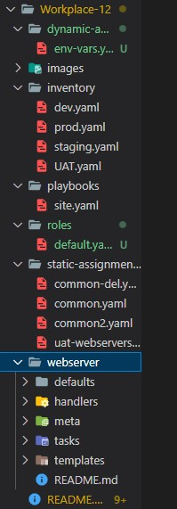

# ANSIBLE DYNAMIC ASSIGNMENTS (INCLUDE) AND COMMUNITY ROLES

**OBJECTIVE OF THE PROJECT:**

The objective of this project is to further enhance your knowledge and skills in Ansible by introducing dynamic assignments using the include module. The project builds upon the concepts and modules learned in the [workplace-11](https://github.com/olaniyi2oguns/Workplace-11.git) and [Workplace-12](https://github.com/olaniyi2oguns/Workplace-12.git), focusing on the configuration of UAT servers. The project aims to differentiate between static and dynamic assignments. Static assignments are achieved using the import Ansible module, as demonstrated in [Workplace-12](https://github.com/olaniyi2oguns/Workplace-12.git). In contrast, dynamic assignments utilize the include module. When the import module is used, all statements are pre-processed during playbook parsing. This means that when the site.yml playbook is executed, Ansible processes all the referenced playbooks during the parsing stage. Any changes made to the statements during execution are not considered, making it a static assignment. In contrast, when the include module is used, statements are processed only during the execution of the playbook. Any changes encountered in the statements during execution are considered and utilized. It is important to note that static assignments are generally recommended for playbooks as they provide more reliability. Dynamic assignments, due to their dynamic nature, can make playbook debugging challenging. However, dynamic assignments can be useful for environment-specific variables, which will be introduced in this project.

**Step 1: Introducing Dynamic Assignment Into Our structure**

In [Workplace-12](https://github.com/olaniyi2oguns/Workplace-12.git), create a new branch and name it `dynamic-assignments`.

In the branch, create a new folder and name it `dynamic-assignments`. Then create a new fill named `env-vars.yaml` inside it. `site.yaml` will be instructed to `include` this playbook later. 
So, your folder structure should look like this:



Given that we plan to employ Ansible to configure multiple environments, each with its own distinct attributes such as servername and IP address, it becomes necessary to establish a means of assigning values to variables on a per-environment basis.

Consequently, we will proceed to generate a designated folder, named "env-vars," intended for housing the variables file pertaining to each environment. Thus, for every environment, we shall create corresponding YAML files that will serve the purpose of defining these variables.

Your layout should now look like this:


Now, paste the instruction below into the `env-vars.yaml` file

```
---
- name: collate variables from env specific file, if it exists
  hosts: all
  tasks:
    - name: looping through list of available files
      include_vars: "{{ item }}"
      with_first_found:
        - files:
            - dev.yaml
            - stage.yaml
            - prod.yaml
            - uat.yaml
          paths:
            - "{{ playbook_dir }}/../env-vars"
      tags:
        - always
```
There are 3 things you need to note here:

1. We used `include_vars` syntax instead of `include`, this is because Ansible developers decided to separate different features of the module. From Ansible version 2.8, the `include` module is deprecated and variants of `include_*` must be used. These are:

[include_role](https://docs.ansible.com/ansible/latest/collections/ansible/builtin/include_role_module.html#include-role-module)

[include_tasks](https://docs.ansible.com/ansible/latest/collections/ansible/builtin/include_tasks_module.html#include-tasks-module)

[include_vars](https://docs.ansible.com/ansible/latest/collections/ansible/builtin/include_vars_module.html#include-vars-module)


In the same version, variants of import were also introduces, such as:

[import_role](https://docs.ansible.com/ansible/latest/collections/ansible/builtin/import_role_module.html#import-role-module)

[import_tasks](https://docs.ansible.com/ansible/latest/collections/ansible/builtin/import_tasks_module.html#import-tasks-module)

2. We made use of a [special variables](https://docs.ansible.com/ansible/latest/reference_appendices/special_variables.html) `{ playbook_dir }` and `{ inventory_file }`. `{ playbook_dir }` will help Ansible to determine the location of the running playbook, and from there navigate to other path on the filesystem. `{ inventory_file }` on the other hand will dynamically resolve to the name of the inventory file being used, then append `.yaml` so that it picks up the required file within the `env-vars` folder.

3. We are including the variables using a loop. `with_first_found` implies that, looping through the list of files, the first one found is used. This is good so that we can always set default values in case an environment specific env file does not exist.


**Step 2: Update site.yaml with Dynamic Assignments**

Update `site.yaml` file to make use of the dynamic assignment.

Note: At this point, we cannot test it yet

your `site.yaml` file should look like this

```
---
- hosts: all
- name: Include dynamic variables 
  tasks:
  import_playbook: ../static-assignments/common.yaml 
  include: ../dynamic-assignments/env-vars.yaml
  tags:
    - always

-  hosts: webservers
- name: Webserver assignment
  import_playbook: ../static-assignments/webservers.yaml
```

**Step 3: Community Roles**

It is now the moment to establish a role for the MySQL database. This role will involve installing the MySQL package, creating a database, and configuring users. However, there is no need to recreate what has already been done. Countless roles have already been crafted by other open source engineers, which are fully operational and adaptable to various Linux flavors. Thanks to Ansible Galaxy, we can effortlessly obtain a pre-made Ansible role and proceed without delay.

Download mysql ansible role. You can check for available community roles [here](https://galaxy.ansible.com/home)

We will be using a [MySQL role developed by geerlingguy](https://galaxy.ansible.com/geerlingguy/mysql)

Hint: To preserve your your GitHub in actual state after you install a new role – make a commit and push to master your '[Workplace-12](https://github.com/olaniyi2oguns/Workplace-12.git)' directory. Of course you must have git installed and configured on `Jenkins` server and, for more convenient work with codes, you can configure Visual Studio Code to work with this directory. In this case, you will no longer need webhook and Jenkins jobs to update your codes on `Jenkins` server, so you can disable it – we will be using Jenkins later for a better purpose.

On `Jenkins` server, make sure `git` is installed with command `git --version`. Should you don't have git, kindly install it on the server. Then, enter into [Workplace-12](https://github.com/olaniyi2oguns/Workplace-12.git) directory and run the commands below:

```
git init
git pull https://github.com/<your-name>/ansible-config-mgt.git
git remote add origin https://github.com/<your-name>/ansible-config-mgt.git
git branch roles-feature
git switch roles-feature
```
Should you don't have your `ansible.cfg` file in the directory, kindly create one with `vi ansible.cfg` and type in

```
[defaults]
roles_path= roles/
```
Inside roles directory, create your new MySQL role with `ansible-galaxy install geerlingguy.mysql` and rename the folder to `mysql` with `mv geerlingguy.mysql/ mysql`

Read `README.md` file, and edit roles configuration to use correct credentials for MySQL required for the `tooling` website.

Now it is time to upload the changes into your GitHub:

```
git add .
git commit -m "Commit new role files into GitHub"
git push --set-upstream origin roles-feature
```
Now, if you are satisfied with your codes, you can create a Pull Request and merge it to `main` branch on GitHub.

**Step 4: Load Balacer Roles**

We want to be able to choose which Load Balancer to use, `Nginx` or `Apache`, so we need to have two roles respectively:

Nginx
Apache

With your experience on Ansible so far you can:

Decide if you want to develop your own roles, or find available ones from the community

Update both `static-assignment` and `site.yaml` files to refer the roles

install nginx role with
`ansible-galaxy install geerlingguy.nginx` and rename with `mv geerlingguy.nginx nginx_role`

`ansible-galaxy install geerlingguy.apache`
and rename with `mv geerlingguy.apache apache_role`

Important Hints:

Since you cannot use both **Nginx** and **Apache** load balancer, you need to add a condition to enable either one – this is where you can make use of variables.

Declare a variable in `defaults/main.yaml` file inside the Nginx and Apache roles. Name each variables `enable_nginx_lb` and `enable_apache_lb` respectively.

Set both values to false like this `enable_nginx_lb: false` and `enable_apache_lb: false.`

Declare another variable in both roles `load_balancer_is_required` and set its value to `false` as well
Update both assignment and `site.yaml` files respectively.

Inside `static_assignment` folder, create `loadbalancer.yaml` file and type in:

```
- hosts: lb
  roles:
    - { role: nginx, when: enable_nginx_lb and load_balancer_is_required }
    - { role: apache, when: enable_apache_lb and load_balancer_is_required }
```
Update `site.yaml` file with 

```
- name: Loadbalancers assignment
       hosts: lb
         - import_playbook: ../static-assignments/loadbalancers.yaml
        when: load_balancer_is_required 
```

Now you can make use of `env-vars\uat.yaml` file to define which loadbalancer to use in UAT environment by setting respective environmental variable to true.

You will activate load balancer, and enable `nginx` by setting these in the respective environment’s `env-vars` file.

```
enable_nginx_lb: true
load_balancer_is_required: true
```

The same must work with apache LB, so you can switch it by setting respective environmental variable to true and other to false.

To test this, you can update inventory for each environment and run Ansible against each environment.


